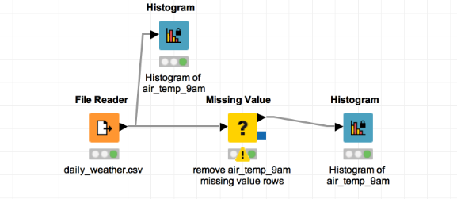

# KNIME-handling-missing-data-
This more like a "Hello world" , for KNIME and handling missing data 

This is my first programe in KNIME. The daily_weather data set was loaded and in various ways of missing data was handled.

KNIME allows users to visually create data flows (or pipelines), selectively execute some or all analysis steps, and later inspect the results, models, using interactive views. KNIME is written in Java and based on Eclipse and makes use of its extension mechanism to add plugins providing additional functionality
